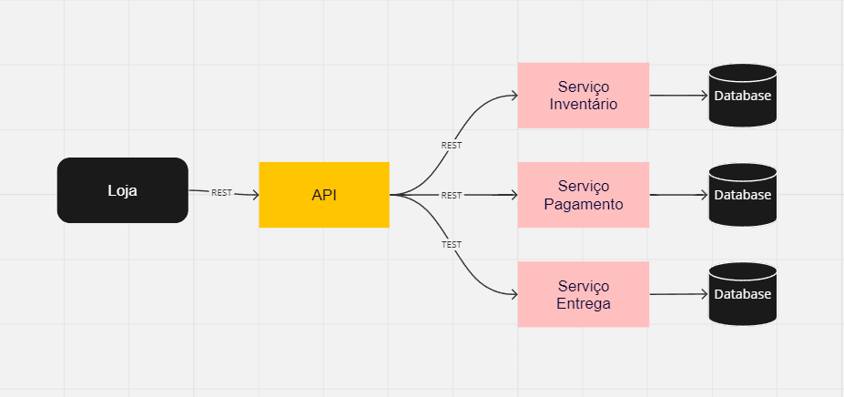

# Teste

# Implementação 

A aplicação foi escrita com C#/.Net.
Como estrutura, ela segue superficialmente o DDD (Domain Drive Design), pois faltam de algumas camadas e recursos, como a camada de infra, que não cabiam nesse primeiro momento de implementação.


O ponto de entrada é no endpoint

<details>
<summary><code>POST "{Localhost}/Credit"</code> </summary>


#### Body 

```Json
{
  "valor": 1000,
  "tipo": "Imobiliario",
  "qtyParcelas": 10,
  "vencimentoInicial": "2023-12-20T16:17:28.302Z"
}
```

#### Response 

`200 Aprovado`
```Json
{
  "status": "Aprovado",
  "valorTotal": 12201.9,
  "valorJuros": 2201.9
}
```

`200 Recusado`
```Json
{
  "status": "Recusado",
  "valorTotal": 0,
  "valorJuros": 0
}
```
</details>

------------------------------------------------------------------------------------------

```javascript
-- create
CREATE TABLE CLIENTE (
  Id int not null primary key,
  Nome varchar(50), 
  CPF varchar(11) not null, 
  UF varchar(2) not null, 
  Celular varchar(50)
);

CREATE TABLE FINANCIAMENTO (
  Id int not null primary key,
  CPF varchar(11) not null, 
  TipoFinanciamento varchar(50) not null, 
  Valor money not null, 
  DataUltimoVencimento date not null,
  ClienteId int FOREIGN KEY REFERENCES CLIENTE(Id)
);

CREATE TABLE PARCELA (
  Id int not null primary key, 
  QtyParcelas int not null, 
  ValorParcela money not null, 
  DataVencimento date not null, 
  DataPagamento date,
  FinanciamentoId int FOREIGN KEY REFERENCES FINANCIAMENTO(Id)
);

-- insert
INSERT INTO CLIENTE(id,Nome,CPF,UF,Celular) VALUES (1, 'ygor', '00998877665','DF','99888888');
INSERT INTO FINANCIAMENTO(Id,CPF,TipoFinanciamento,Valor,DataUltimoVencimento,ClienteId) VALUES (1, '07678877665','Imobiliario','10000','2017-10-25',1);
INSERT INTO PARCELA(Id,QtyParcelas,ValorParcela,DataVencimento,DataPagamento,FinanciamentoId) VALUES (1,20,'5000','2023-11-20','2017-10-25',1);
INSERT INTO PARCELA(Id,QtyParcelas,ValorParcela,DataVencimento,DataPagamento,FinanciamentoId) VALUES (4,20,'5000','2013-12-19','2023-12-20',1);
INSERT INTO PARCELA(Id,QtyParcelas,ValorParcela,DataVencimento,DataPagamento,FinanciamentoId) VALUES (5,20,'5000','2013-11-19',null,1);
INSERT INTO PARCELA(Id,QtyParcelas,ValorParcela,DataVencimento,DataPagamento,FinanciamentoId) VALUES (6,20,'5000','2013-11-19','2023-12-20',1);

INSERT INTO CLIENTE(id,Nome,CPF,UF,Celular) VALUES (2, 'joao', '00998877664','DF','99888888');
INSERT INTO FINANCIAMENTO(Id,CPF,TipoFinanciamento,Valor,DataUltimoVencimento,ClienteId) VALUES (2, '07678877664','Imobiliario','10000','2017-10-25',2);
INSERT INTO PARCELA(Id,QtyParcelas,ValorParcela,DataVencimento,DataPagamento,FinanciamentoId) VALUES (2,20,'5000','2023-12-20',null,2);

INSERT INTO CLIENTE(id,Nome,CPF,UF,Celular) VALUES (3, 'caio', '00998877663','DF','99888888');
INSERT INTO FINANCIAMENTO(Id,CPF,TipoFinanciamento,Valor,DataUltimoVencimento,ClienteId) VALUES (3, '07678877663','Imobiliario','10000','2017-10-25',3);
INSERT INTO PARCELA(Id,QtyParcelas,ValorParcela,DataVencimento,DataPagamento,FinanciamentoId) VALUES (3,20,'5000','2017-11-25',null,3);

-- fetch 

select CLIENTE.Id, CLIENTE.Nome from CLIENTE
  inner join FINANCIAMENTO
      on  FINANCIAMENTO.ClienteId = CLIENTE.Id
  inner join PARCELA 
      on PARCELA.FinanciamentoId = FINANCIAMENTO.Id
  group by CLIENTE.Id,CLIENTE.Nome
  having (count(PARCELA.DataPagamento) *100/count(*) ) >= 60


select CLIENTE.Id, CLIENTE.Nome,PARCELA.DataVencimento, DATEDIFF(second,PARCELA.DataVencimento,GETDATE())/86400 as dias from CLIENTE
  inner join FINANCIAMENTO
      on  FINANCIAMENTO.ClienteId = CLIENTE.Id
  inner join PARCELA 
      on PARCELA.FinanciamentoId = FINANCIAMENTO.Id
  group by CLIENTE.Id, CLIENTE.Nome,PARCELA.DataVencimento, PARCELA.DataPagamento
  having DATEDIFF(second,PARCELA.DataVencimento,GETDATE())/86400 > 5 and PARCELA.DataPagamento is null
```


  # Microsserviços

  Microsserviços é um tipo de arquitetura utilizada onde o software é divido em pequenos pedaços, chamados serviços, onde cada um deles cumprem um papel e função dentro do software.
  
  Geralmente, o software é construído em cima desses serviços, onde um processo pode ser executado por um serviço. A comunicação entre os serviços, é por meio de uma API.

  Essa arquitetura tem como benefício escalar com autonomia. Com ela é possível conseguir entregar valor com rapidez e frequência, principalmente em softwares maiores e mais complexos, pois com essa abordagem, permite a implementação de novos recursos com velocidade, sem reescrever blocos grandes como em um monólito, pois cada código fica no seu contexto.

  

  Como Demonstrado no diagrama acima, temos um exemplo com 3 serviços em uma loja.

  O primeiro, o serviço de inventário, gerencia todas as informações referentes a produto, como estoque, preço, etc. 
  
  O segundo, o serviço de pagamento, gerencia todas as informações referentes a pagamento, como cobrança do cartão, etc.

  E por último, o serviço de entrega, gerencia todas as informações referentes a envio do produto ao cliente após a finalizar a compra.

  Com esse exemplo, vemos que cada contexto fica separado em um serviço, cada um com a sua função dentro do software.

